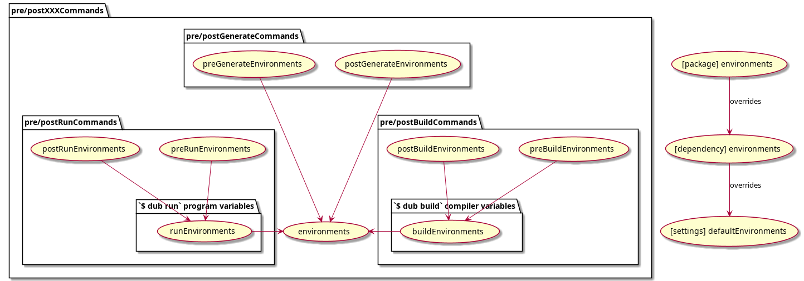

# Environment Variables

!!! note "Work-in-Progress Documentation"

    The content on this page is not yet fully finished.

    Tracking issue: <https://github.com/dlang/dub-docs/issues/65>

## Environment variables DUB reads

- `DUB_HOME`
- `DPATH`
- `DFLAGS`
- `http_proxy`
- `no_proxy`
- `NO_COLOR`
- `TEMP` (Windows only)
- `DUB_NO_RESOLVE_LIMIT`
- [`DUB_REGISTRY`](./registries.md#dubregistry-environment-variable)
- `DUBPATH`
- `DC`
- `PATH`
- `ProgramData` (Windows only)
- `APPDATA` (Windows only)
- `HOME` (POSIX only)
- `USERNAME` (Windows only)
- `USER` (POSIX only)

set by dub in commands:

- `PACKAGE_DIR` - Path to the package itself
- `ROOT_PACKAGE_DIR` - Path to the root package of the build dependency tree
- `<PKG>_PACKAGE_DIR` - Path to a specific package that is part of the package's dependency graph. $<name> must be in uppercase letters without the semver string.
- `DUB` - Path to the DUB executable
- `DUB_PACKAGE` - Name of the package
- `DUB_PACKAGE_VERSION` - Version of the package
- `DUB_ROOT_PACKAGE` - Name of the root package that is being built
- `DUB_ROOT_PACKAGE_TARGET_TYPE` - Contents of the "targetType" field of the root package as defined by the package recipe
- `DUB_ROOT_PACKAGE_TARGET_PATH` - Contents of the "targetPath" field of the root package as defined by the package recipe
- `DUB_ROOT_PACKAGE_TARGET_NAME` - Contents of the "targetName" field of the root package as defined by the package recipe
- `DFLAGS` - Contents of the "dflags" field as defined by the package recipe
- `LFLAGS` - Contents of the "lflags" field as defined by the package recipe
- `VERSIONS` - Contents of the "versions" field as defined by the package recipe
- `LIBS` - Contents of the "libs" field as defined by the package recipe
- `SOURCE_FILES` - Contents of the "sourceFiles" field as defined by the package recipe
- `IMPORT_PATHS` - Contents of the "importPaths" field as defined by the package recipe
- `STRING_IMPORT_PATHS` - Contents of the "stringImportPaths" field as defined by the package recipe
- `DC` - Compiler binary name (e.g. "../dmd" or "ldc2")
- `DC_BASE` - Canonical name of the compiler (e.g. "dmd" or "ldc")
- `D_FRONTEND_VER` - The compiler frontend version represented as a single integer, for example "2072" for DMD 2.072.2
- `DUB_EXE` - Path to the DUB executable
- `DUB_PLATFORM` - Name of the target platform (e.g. "windows" or "linux")
- `DUB_ARCH` - Name of the target architecture (e.g. "x86" or "x86_64")
- `DUB_TARGET_TYPE` - Contents of the "targetType" field as defined by the package recipe
- `DUB_TARGET_PATH` - Contents of the "targetPath" field as defined by the package recipe
- `DUB_TARGET_NAME` - Contents of the "targetName" field as defined by the package recipe
- `DUB_WORKING_DIRECTORY` - Working directory in which the compiled program gets run
- `DUB_MAIN_SOURCE_FILE` - Contents of the "mainSourceFile" field as defined by the package recipe
- `DUB_CONFIG` - Name of the selected build configuration (e.g. "application" or "library")
- `DUB_BUILD_TYPE` - Name of the selected build type (e.g. "debug" or "unittest")
- `DUB_BUILD_MODE` - Name of the selected build mode (e.g. "separate" or "singleFile")
- `DUB_BUILD_PATH` - Absolute path in which the package was compiled (defined for "postBuildCommands" only)
- `DUB_COMBINED` - "TRUE" if the --combined flag was used, empty otherwise
- `DUB_RUN` - "TRUE" if the "run" command was invoked, empty otherwise
- `DUB_FORCE` - "TRUE" if the --force flag was used, empty otherwise
- `DUB_RDMD` - "TRUE" if the --rdmd flag was used, empty otherwise
- `DUB_TEMP_BUILD` - "TRUE" if the --temp-build flag was used, empty otherwise
- `DUB_PARALLEL_BUILD` - "TRUE" if the --parallel flag was used, empty otherwise
- `DUB_RUN_ARGS` - Contains the arguments passed to the built executable in shell compatible format

## User specified environment variables

Environment variables are set by keys using the [defaultEnvironments](../dub-reference/settings.md#defaultenvironments) and related settings in the [user settings](../dub-reference/settings.md). Additionally, with higher precedence, environments and related settings in the [package recipe](../dub-reference/recipe.md#environment-variables) are loaded.

For finding the default environment variables first the system environment variables are loaded, then overridden by the user settings environment variables. This goes through all the default settings first.

Afterwards dependency or [recipe](../dub-guide/recipe.md#environment-variables) environment variables override these default environment variables. Recipe variables have higher precedence than dependency variables.

Defining a generic environments block inside a dependency overrides the keys set by e.g. defaultPreRunEnvironments inside the settings.
